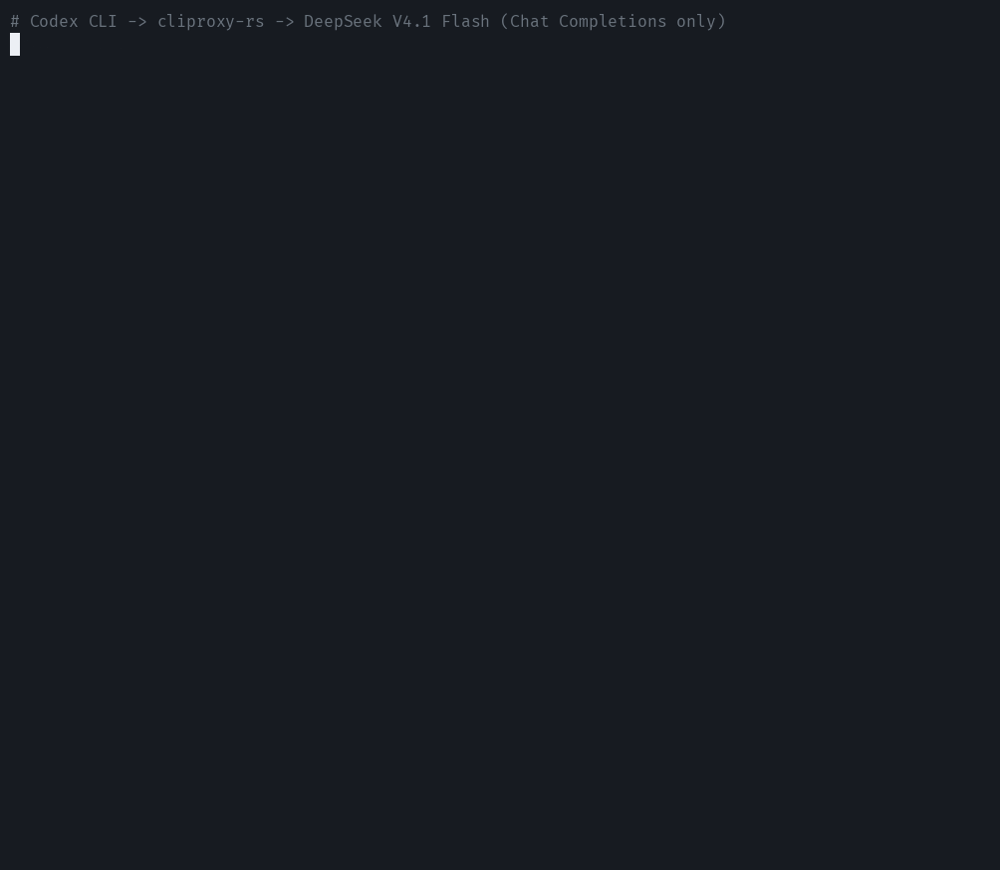

# cliproxy-rs

[](https://github.com/vayungodara/cliproxy-rs/actions/workflows/ci.yml)
[](https://github.com/vayungodara/cliproxy-rs/releases/latest)
[](https://github.com/vayungodara/homebrew-tap)

One local endpoint so Codex CLI, Claude Code and other tools can use DeepSeek, GLM, Kimi, OpenRouter or your own gateway, with your API keys or your own accounts. You can mix providers and translate between the OpenAI, Anthropic and Gemini APIs.

## Quick start

1. On macOS or Linux:

   ```sh
   curl -fsSL https://raw.githubusercontent.com/vayungodara/cliproxy-rs/master/install.sh | sh
   ```

   On Windows, in PowerShell:

   ```powershell
   irm https://raw.githubusercontent.com/vayungodara/cliproxy-rs/master/install.ps1 | iex
   ```

   The installer checks the release checksum, writes `~/.cliproxy-rs/config.yaml`, starts the proxy and opens the dashboard. On Windows, the config is `%USERPROFILE%\.cliproxy-rs\config.yaml`. It saves new keys in `keys.env` without printing them.

   On Windows you can also use [Scoop](https://scoop.sh). It installs the binary only, so create the config and keys as in [First run without the install script](docs/INSTALL.md#first-run-without-the-install-script):

   ```powershell
   scoop bucket add vayungodara https://github.com/vayungodara/scoop-bucket
   scoop install vayungodara/cliproxy-rs
   ```

   Or, on macOS or Linux, with Homebrew:

   ```sh
   brew install vayungodara/tap/cliproxy-rs
   brew services start cliproxy-rs
   ```

   Its config and `keys.env` live in `$(brew --prefix)/etc/cliproxy-rs/`, and the dashboard is at `http://127.0.0.1:8317/management.html`. See [Homebrew](docs/INSTALL.md#homebrew).

2. Sign in to the dashboard with `CLIPROXY_MANAGEMENT_KEY` from the `keys.env` next to your config. Connect your own account or add a provider API key. Read [Accounts and provider terms](#accounts-and-provider-terms) before connecting a subscription.

3. Open the dashboard's **Use with tools** page and copy the Codex CLI or Claude Code settings. Your tools use `CLIPROXY_CLIENT_KEY`, not the management key.

Run the install command again to upgrade, or `brew upgrade cliproxy-rs` with Homebrew. Both keep your config and keys. [INSTALL.md](docs/INSTALL.md) covers start at login, release binaries, Docker and building from source. [GETTING-STARTED.md](docs/GETTING-STARTED.md) has the longer walkthrough.

## What is this?

cliproxy-rs is a Rust rewrite of [CLIProxyAPI](https://github.com/router-for-me/CLIProxyAPI). It reads the same `config.yaml` and credential formats and implements the client routes and v8 Management API. Parity is incomplete: the audit has 1,687 items, with 835 covered, 707 partial and 145 missing. [PARITY.md](docs/PARITY.md) defines those counts.

The dashboard shows accounts, provider limits, request history and tool settings.

<p align="center">
  <a href="https://x.com/vayungodara/status/2106492049490899062"></a>
  <br><sub><a href="https://x.com/vayungodara/status/2106492049490899062">Watch the launch film</a></sub>
</p>

<p align="center">
  <picture>
    <source media="(prefers-color-scheme: dark)" srcset="docs/img/overview-dark.png">
    
  </picture>
</p>

## Use it with your tools

The local OpenAI base URL is `http://127.0.0.1:8317/v1`. Claude Code and Gemini clients use `http://127.0.0.1:8317` without `/v1`. Use your installation's port and client key.

[CLIENTS.md](docs/CLIENTS.md) has client settings, including [GPT in Claude Code](docs/CLIENTS.md#gpt-in-claude-code). Not every model and tool combination has been tested.

## API keys: Codex CLI and mixed providers

You do not need a subscription login. Merge this provider block into `~/.cliproxy-rs/config.yaml`, or `%USERPROFILE%\.cliproxy-rs\config.yaml` on Windows. Keep `access.api-keys`, `management.secret-key` and the rest of your config. The proxy reloads the configuration on save. The upstream keys below are separate from your proxy's client key. Replace the key and upstream model placeholders with values from each provider.

```yaml
api-keys:
  openai-compatibility:
    - name: deepseek
      base-url: "https://api.deepseek.com"
      keys:
        - api-key: "<deepseek-api-key>"
      models:
        - name: "<deepseek-model-id>"
          alias: "deepseek"
    - name: openrouter
      base-url: "https://openrouter.ai/api/v1"
      keys:
        - api-key: "<openrouter-api-key>"
      models:
        - name: "<openrouter-model-id>"
          alias: "router"
```

Use the same structure for any of these metered APIs. The base URL excludes `/chat/completions`; the proxy adds it.

| Provider | Base URL | Model IDs and API access |
| --- | --- | --- |
| DeepSeek | `https://api.deepseek.com` | [DeepSeek API docs](https://api-docs.deepseek.com/) |
| GLM (Z.ai) | `https://api.z.ai/api/paas/v4` | [Z.ai API docs](https://docs.z.ai/api-reference/introduction) |
| Kimi (Moonshot) | `https://api.moonshot.ai/v1` | [Moonshot API docs](https://platform.moonshot.ai/docs) |
| OpenRouter | `https://openrouter.ai/api/v1` | [OpenRouter API docs](https://openrouter.ai/docs/quickstart) |
| OpenCode Go | `https://opencode.ai/zen/go/v1` | [OpenCode Go docs](https://opencode.ai/docs/go/); use its Chat Completions models, and add `headers: {x-opencode-session: $CPA-SESSION-ID}` to the entry, which sends each conversation's session ID; OpenCode Go rejects requests without one |

Put this in `~/.codex/config.toml`:

```toml
model = "deepseek"
model_provider = "cliproxy"

[model_providers.cliproxy]
name = "cliproxy-rs"
base_url = "http://127.0.0.1:8317/v1"
env_key = "CLIPROXY_CLIENT_KEY"
wire_api = "responses"
```

```sh
export CLIPROXY_CLIENT_KEY=your-client-key
codex
```

Use the port and `CLIPROXY_CLIENT_KEY` from your installation's `keys.env`. Codex CLI sends Responses requests to the proxy; the proxy translates them to Chat Completions for these upstreams. Set `model = "router"` to use the second provider. Other clients can use either alias at the same endpoint, alongside any connected subscription accounts.

For failover, give two provider entries the same model alias, or add another key to a provider's `keys` list. By default, a 429 cools that credential for the failing model, and the proxy tries another eligible credential for the alias, within the configured attempt limits and error rules. [MULTI-ACCOUNT.md](docs/MULTI-ACCOUNT.md#cooldowns-and-limits) explains retries when none are ready.

<p align="center"></p>

On 7 October 2026, Codex CLI 0.160 finished a task with a file edit and a shell command through cliproxy-rs 0.2.2, using DeepSeek V4.1 Flash on OpenCode Go's Chat Completions endpoint (above). The DeepSeek, GLM, Kimi and OpenRouter endpoints in the table haven't been run live.

## Accounts and provider terms

This project is for one person using their own accounts on their own machines. Keep the proxy and its keys private. It is not a shared subscription service.

Use the provider's sanctioned path where one exists:

- OpenAI offers [Sign in with ChatGPT](https://developers.openai.com/cookbook/articles/sign-in-with-chatgpt) so eligible users can use their plan in participating tools, including local personal projects. That permission depends on the integration and consent scopes. cliproxy-rs's Codex login follows CLIProxyAPI's existing login flow; it is not the new Sign in with ChatGPT integration.
- Claude Code supports [gateway configuration](https://code.claude.com/docs/en/llm-gateway-connect). You can route other models into Claude Code through the proxy using their API keys. Anthropic's [authentication rules](https://code.claude.com/docs/en/legal-and-compliance#authentication-and-credential-use) reserve Claude subscription OAuth for Claude Code and other native Anthropic applications. Use an API key or supported cloud provider for Claude in third-party tools.

Personal use is still subject to each provider's terms, and providers can restrict or suspend accounts that break them. Sharing an account, or using it to serve other people, is the clearest case.

### Several accounts

Each sign-in creates a file in `auth-dir`. Routing chooses among ready credentials with `round-robin`, `fill-first`, `weighted-round-robin` or the opt-in, experimental `soonest-reset` strategy. The installer enables session affinity to keep a conversation on one account. When the setting is omitted, the server default is off. A 429 can move the request to another ready credential for that model. [MULTI-ACCOUNT.md](docs/MULTI-ACCOUNT.md) covers routing and access from your other machines.

## CLIProxyAPI compatibility

Config and protocol tests check compatibility with Go CLIProxyAPI at `6fecc6e`. The bundled dashboard has tests against both servers. No third-party CLIProxyAPI app has been tested with cliproxy-rs yet.

Before switching, read [MIGRATING-FROM-GO.md](docs/MIGRATING-FROM-GO.md), especially the refresh-token warning. The default Docker image expects `/data/config.yaml` and runs as UID/GID 10001. Update mounts and permissions, or override `--config` and set an accessible `oauth.auth-dir` to keep existing paths.

## Terminal UI

`cliproxy -tui` manages a running server. It uses `-management-base-url`, then `management.base-url`, then `http://127.0.0.1:<port>`, and asks for the management key. `cliproxy -tui -standalone` starts the server in the same process and stops it when you quit. Standalone mode needs a loopback or wildcard `host` and no `server.tls`.

## Upcoming features

Not in cliproxy-rs yet:

- An AUR package.
- Plugin-owned credentials, models and executors without a model router; plugin schedulers, request and response translators, thinking appliers, `host.model.*` callbacks and the WebSocket response observer. Existing plugins can load, serve routes and quotas, install from the store and participate in frontend auth, model routing, interceptors and usage hooks.
- Home-managed plugin sync, tasks and status reports. Home usage, log and in-flight reporting and KV storage already work.
- Google Antigravity accounts.
- Vertex service-account import from the dashboard. The command line works.
- The `pprof` debug listener.
- The remaining parity gaps and Go test cases, listed in [PARITY.md](docs/PARITY.md).

## Performance

In the [Claude soak](docs/BENCHMARKS.md#claude-soak-large-prompts-and-memory), cliproxy-rs held 29 MB 30 seconds after 3,000 requests averaging 306 KB, and 43 MB after 600 requests averaging 1.9 MB. In an hour of the [field mix](docs/BENCHMARKS.md#field-mix-claude-codex-and-count_tokens) (Claude, Codex and count_tokens requests averaging 1 MB from 4 sessions), its resting RSS stayed between 80.6 and 97.6 MB and it peaked at 169.0 MB, where 0.2.0 rested between 128.2 and 145.4 MB and peaked at 220.1 MB; each build ran on its own CI runner, at the same time. [Two 32 MB tokenizers](https://dev.to/vayun/two-32-mb-tokenizers-hunting-a-memory-floor-in-a-rust-proxy-4hfl) explains how that floor was found and what is still unexplained. A personal install in daily use ran at 75 to 101 MB RSS. That reading was unscripted; sample timing, workload and the exact build were not recorded.

On the [small-request benchmark](docs/BENCHMARKS.md#setup), the launch build answered its first request in 15 to 46 ms over three rounds, and Go in 104 to 453 ms in the same run. Go took 45 to 98 ms in quieter runs. The launch build served 793 translated streams/s against Go's 564.

Go won non-streaming throughput: 1,568 requests/s against 1,168, with 0.62 ms of CPU per request against 0.85 ms. Go also won plain streaming throughput, 916 against 833 streams/s. With 256 slow streams, cliproxy-rs had a worse p99 latency: 1,414.5 ms against Go's 1,272.2 ms. These synthetic results are from the 0.1.0 launch build. [BENCHMARKS.md](docs/BENCHMARKS.md) records the methods, raw results and later Claude measurements.

## Documentation

- [Getting started](docs/GETTING-STARTED.md) and [installation](docs/INSTALL.md).
- [Client settings](docs/CLIENTS.md), [several accounts](docs/MULTI-ACCOUNT.md) and [configuration](docs/CONFIGURATION.md).
- [Moving from CLIProxyAPI](docs/MIGRATING-FROM-GO.md) and [differences from Go](docs/DIFFERENCES-FROM-GO.md).
- [Parity](docs/PARITY.md) and [benchmarks](docs/BENCHMARKS.md).

## Security

The dashboard is built into the binary. Model catalogs are downloaded at start and every three hours; `--local-model` turns that off.

Keep `access.api-keys` set and `server.host` on `127.0.0.1` unless your other machines need access. Behind a local tunnel or reverse proxy, set `server.trusted-proxies`; otherwise internet clients count as local. [Running it safely](docs/GETTING-STARTED.md#running-it-safely) explains this. [SECURITY.md](SECURITY.md) covers vulnerability reports.

## Development

The Rust workspace is under `crates/`; the dashboard is under `ui/`. Tests use local mock upstreams. CI runs fmt, clippy and the full suite, with Go and PostgreSQL comparison tests. The [differential harness](harness/README.md) compares 57 cases against CLIProxyAPI.

```sh
cargo fmt --all --check
cargo clippy --workspace --all-targets --locked -- -D warnings
cargo test --workspace --locked
```

[CONTRIBUTING.md](CONTRIBUTING.md) explains how to contribute.

Built with some help from AI.

## License

MIT. See [LICENSE](LICENSE). CLIProxyAPI is also MIT licensed.
