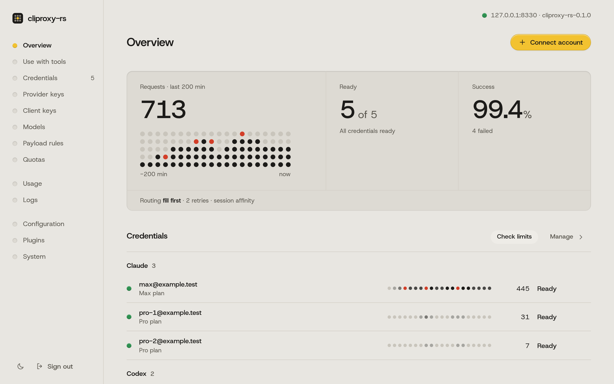

# cliproxy-rs

[](https://github.com/vayungodara/cliproxy-rs/actions/workflows/ci.yml)

<p align="center">
  <a href="https://x.com/vayungodara/status/2106492049490899062"></a>
  <br><sub><a href="https://x.com/vayungodara/status/2106492049490899062">Watch the launch film</a></sub>
</p>

## What is this?

cliproxy-rs is a Rust rewrite of [CLIProxyAPI](https://github.com/router-for-me/CLIProxyAPI). It is a small server you run on your own computer that gives your coding tools, such as Claude Code, Codex CLI or Cursor, one local endpoint for the Anthropic, OpenAI and Gemini APIs, and it translates requests and responses between those formats.

It aims to be a drop-in replacement for the Go version: it reads the same `config.yaml` and the same auth files and serves the same v8 Management API, so you can switch between the two in either direction. Parity is not complete yet; [docs/PARITY.md](docs/PARITY.md) tracks what is covered. The dashboard is built into the binary. It shows which accounts work, how much of each plan's limits is left, and how to connect each tool.

<p align="center">
  <picture>
    <source media="(prefers-color-scheme: dark)" srcset="docs/img/overview-dark.png">
    
  </picture>
</p>

## Why would I want it?

- A tool speaks only one API: the proxy translates between the Anthropic, OpenAI and Gemini formats, so an OpenAI-only tool can use a Claude account and the other way round.
- You run CLIProxyAPI and want a smaller, faster-starting binary with the dashboard built in, without changing your config or auth files.
- You want Claude Code, Codex CLI and your editor to use the subscriptions and API keys you already have, like a Claude Max plan or a ChatGPT plan, through one local address.
- You want the 5-hour and weekly limits of your accounts on one screen.

## Quick start

1. Run one command. On macOS or Linux:

   ```sh
   curl -fsSL https://raw.githubusercontent.com/vayungodara/cliproxy-rs/master/install.sh | sh
   ```

   On Windows, in PowerShell:

   ```powershell
   irm https://raw.githubusercontent.com/vayungodara/cliproxy-rs/master/install.ps1 | iex
   ```

   It installs the latest release after checking its checksum, writes a config with new keys to `~/.cliproxy-rs`, starts the proxy in the background and opens the dashboard in your browser. The keys stay in `~/.cliproxy-rs/keys.env` and are never printed.

2. In the dashboard, sign in with the `CLIPROXY_MANAGEMENT_KEY` line from `keys.env` and choose Connect account. Read the note on [provider terms](#accounts-and-provider-terms) before you connect a subscription.

3. Open Use with tools and copy the settings for Claude Code, Codex CLI or another tool.

Run the same command again to upgrade; your config and keys stay as they are. [docs/INSTALL.md](docs/INSTALL.md#start-at-login) shows how to start the proxy when you log in.

[docs/GETTING-STARTED.md](docs/GETTING-STARTED.md) walks through the same steps in more detail.

## Set up with an AI agent

Paste this into Claude Code, Codex or another coding agent on the computer where you want the proxy:

```text
Install and set up cliproxy-rs on this computer by following
https://github.com/vayungodara/cliproxy-rs/blob/master/docs/AI-SETUP.md exactly.
Do not sign in to any of my accounts or print my keys; tell me when it is my turn.
```

The agent runs the installer, which picks a free port without touching an existing CLIProxyAPI and keeps the keys in a file only you can read. It checks that the proxy answers, then hands the account sign-in to you.

## Use it with your tools

The proxy serves the Anthropic Messages API at `http://127.0.0.1:8317`, the OpenAI API at `http://127.0.0.1:8317/v1` and the Gemini API at `http://127.0.0.1:8317`, all with your client key. For Claude Code:

```sh
export ANTHROPIC_BASE_URL=http://127.0.0.1:8317
export ANTHROPIC_AUTH_TOKEN=your-client-key
claude
```

[docs/CLIENTS.md](docs/CLIENTS.md) has copy-paste setups for Claude Code, Codex CLI, Gemini CLI, Amp, OpenCode, Factory Droid, Cline, Roo Code, Kilo Code, Cursor, Zed, Continue, Aider and the OpenAI, Anthropic and Gemini SDKs.

## Accounts and provider terms

Using a subscription outside its official app can break the provider's terms, and providers have suspended accounts for it. Whether to do that is your call and your risk.

### Several accounts

Like CLIProxyAPI, the proxy can hold more than one Claude or Codex account. Each sign-in becomes one file in `auth-dir`, and a routing setting decides which account serves each request: `round-robin`, `fill-first`, `weighted-round-robin`, or `soonest-reset` (experimental, a cliproxy-rs addition that prefers the account whose weekly window resets soonest). Session affinity, which is off by default, keeps each conversation on one account so the provider's prompt cache stays warm. When a provider answers 429, the proxy puts that account in a cooldown for that model and uses the next ready account. [docs/MULTI-ACCOUNT.md](docs/MULTI-ACCOUNT.md) covers routing, cooldowns, the quota view, per-account proxies, Codex over WebSocket and reaching the proxy from your other machines over Tailscale.

## Terminal UI

`cliproxy -tui` opens a terminal management client for a running server. It connects to `-management-base-url`, else the config's `management.base-url`, else `http://127.0.0.1:<port>`, and asks for the management key. `cliproxy -tui -standalone` starts the proxy in the same process, signs in for you and stops the proxy when you quit; it needs a loopback or wildcard `host` and no `server.tls`.

## Works with CLIProxyAPI apps

cliproxy-rs serves the same routes and the same v8 Management API as CLIProxyAPI, so the community apps built on CLIProxyAPI should work with it, for example [CPA-Manager-Plus](https://github.com/seakee/CPA-Manager-Plus), [CLIProxyAPI Quota Inspector](https://github.com/AllenReder/CLIProxyAPI-Quota-Inspector), [ZeroLimit](https://github.com/0xtbug/zero-limit), [Quotio](https://github.com/nguyenphutrong/quotio), [VibeProxy](https://github.com/automazeio/vibeproxy) and [CCS](https://github.com/kaitranntt/ccs). We have not tested all of them. Apps that talk to a running server need only its address and management key; apps that start their own bundled CLIProxyAPI need an option to use an existing server instead. If an app does not work with cliproxy-rs, please [open an issue](https://github.com/vayungodara/cliproxy-rs/issues/new/choose).

## Install options

- `install.sh` (macOS and Linux) and `install.ps1` (Windows), the commands in the quick start. They install the release binary, set it up and start it; `--binary-only` (`-BinaryOnly` on Windows) installs only the binary.
- Release binaries for macOS (Apple silicon and Intel), Linux (x86_64 and arm64) and Windows (x86_64), with a `SHA256SUMS` file, on the [releases page](https://github.com/vayungodara/cliproxy-rs/releases).
- Docker, from the repository's `Dockerfile`.
- Building from source, for contributors and platforms without a release binary.

[docs/INSTALL.md](docs/INSTALL.md) covers each one, starting the proxy at login, and removing it.

## Upcoming features

These are not in cliproxy-rs yet. They are planned, in no fixed order:

- Homebrew and AUR packages.
- Plugins: providers owned by a plugin (auth files a plugin parses, their models, and their executors without a model router), plugin schedulers, request and response translators, thinking appliers, the `host.model.*` callbacks and the WebSocket response observer. Today plugins load, serve their own routes and quotas, install from the plugin store, add command-line flags and sign in from the dashboard, and requests pass through their frontend auth, model routers, interceptors and usage hooks.
- Home (cluster) mode: reporting usage, logs and in-flight requests back to Home, Home's KV storage, and syncing plugins managed by Home.
- Google Antigravity.
- Image generation and editing through Codex accounts, and importing Vertex service accounts from the dashboard (the command line works).
- The `pprof` debug listener.
- The upstream request and response sections of request log files.
- The rest of CLIProxyAPI's own test cases. The parity audit checked 1,687 Go routes, settings, flags and test suites: 798 (47%) are fully covered, 697 partly and 192 not yet. [docs/PARITY.md](docs/PARITY.md) explains the numbers.

## Documentation

- [Getting started](docs/GETTING-STARTED.md): install, configure, connect an account and a tool.
- [Set up with an AI agent](docs/AI-SETUP.md): exact steps a coding agent can follow.
- [Use it with your tools](docs/CLIENTS.md): setup for each coding tool and SDK.
- [Several accounts](docs/MULTI-ACCOUNT.md): routing, limits, quotas and remote access.
- [Configuration](docs/CONFIGURATION.md): the settings you are most likely to change.
- [Install](docs/INSTALL.md): every install option, Docker and running as a service.
- [Moving from CLIProxyAPI](docs/MIGRATING-FROM-GO.md) and [differences from CLIProxyAPI](docs/DIFFERENCES-FROM-GO.md).
- [Compatibility and parity](docs/PARITY.md) and [benchmarks](docs/BENCHMARKS.md).

## Security

Keep `access.api-keys` set and `server.host` on `127.0.0.1` unless you need other machines to connect. Behind a tunnel or reverse proxy on the same machine, set `server.trusted-proxies`, or every internet client counts as local. The dashboard is built into the binary, and cliproxy-rs never downloads code to run. [Running it safely](docs/GETTING-STARTED.md#running-it-safely) explains each point, and [SECURITY.md](SECURITY.md) says how to report a vulnerability.

## Performance

Go is faster on non-streaming throughput. On a 2-vCPU test machine with a local fake upstream (2026-10-03), CLIProxyAPI handled about 34% more non-streaming requests per second (1,568 against 1,168) and about 10% more plain streams (916 against 833). cliproxy-rs was faster on streams it translates between the Anthropic and OpenAI formats (793 against 564 per second, about 41% more) and used less than half of Go's memory: 17 MB at idle against 45 MB, and 25 to 50 MB under load against 58 to 104 MB. It answers its first request about 17 ms after launch, and the release binary is 36 MB against 69 MB. [docs/BENCHMARKS.md](docs/BENCHMARKS.md) has the method and every number.

## Development

The workspace is `crates/cpa-core` (config and account formats), `crates/cpa-exec` (one module per upstream provider), `crates/cpa-translate` (format translation), `crates/cpa-server` (routes, account selection and the Management API), `crates/cliproxy` (the binary) and `ui/` (the dashboard, see [ui/README.md](ui/README.md)). The workspace has 935 tests, run against local mock upstreams only; CI runs the whole suite on every push, with Go and PostgreSQL installed so the tests that compare against them run too. A [differential harness](harness/README.md) sends the same 57 cases to CLIProxyAPI and cliproxy-rs and compares the results.

```sh
cargo fmt --all --check
cargo clippy --workspace --all-targets --locked -- -D warnings
cargo test --workspace --locked
```

[CONTRIBUTING.md](CONTRIBUTING.md) explains how to send a change.

Built with some help from AI.

## License

MIT. See [LICENSE](LICENSE). CLIProxyAPI, which this project follows closely, is also MIT licensed.
