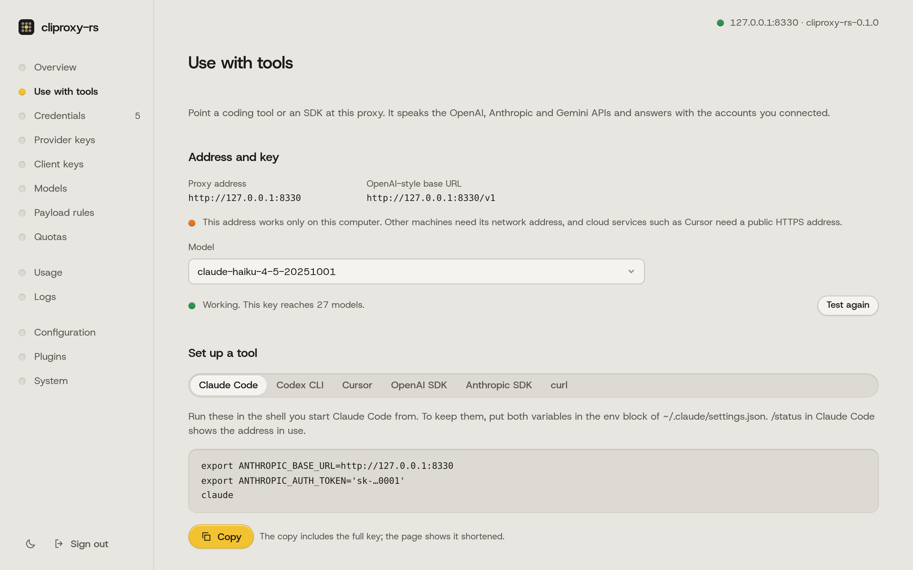

# Getting started

This guide connects a coding tool to your own accounts or API keys through cliproxy-rs. For Codex CLI with API keys and mixed providers, start with the [README recipe](../README.md#api-keys-codex-cli-and-mixed-providers).

## 1. Install and start it

On macOS or Linux:

```sh
curl -fsSL https://raw.githubusercontent.com/vayungodara/cliproxy-rs/master/install.sh | sh
```

On Windows, in PowerShell:

```powershell
irm https://raw.githubusercontent.com/vayungodara/cliproxy-rs/master/install.ps1 | iex
```

The script downloads the release for your machine and checks it against the release's `SHA256SUMS`. It writes `~/.cliproxy-rs/config.yaml` with two new keys, starts the server in the background and checks that it answers. It ends like this:

```text
cliproxy-rs is running at http://127.0.0.1:8317
  Dashboard  http://127.0.0.1:8317/management.html
  Keys       /home/you/.cliproxy-rs/keys.env (show them with: cat /home/you/.cliproxy-rs/keys.env)
  Config     /home/you/.cliproxy-rs/config.yaml
  Log        /home/you/.cliproxy-rs/cliproxy.log
  Stop       kill $(cat '/home/you/.cliproxy-rs/cliproxy.pid')
```

The port is 8317 unless something already uses it, CLIProxyAPI for example; then the script takes the next free one. `keys.env` holds two keys:

- `CLIPROXY_MANAGEMENT_KEY` is the dashboard password.
- `CLIPROXY_CLIENT_KEY` is what your tools send to the proxy.

Only you can read the file, and the script never prints the keys. Run the same command again later to upgrade; it keeps your config and keys. [INSTALL.md](INSTALL.md) covers starting the proxy at login, Docker, building from source and writing the config yourself.

## 2. Open the dashboard

The script opens <http://127.0.0.1:8317/management.html> in your browser (use your port if it picked another). Sign in with `CLIPROXY_MANAGEMENT_KEY`. On a server without a browser, open an SSH tunnel from your own computer first, as [INSTALL.md](INSTALL.md#with-the-install-script) shows.

On a new server, the Overview shows a short Get started card with three steps: connect an account, point a tool at the proxy, and send a test request. It goes away once all three are done, or when you dismiss it.

## 3. Connect an account

<picture>
  <source media="(prefers-color-scheme: dark)" srcset="img/connect-dark.png">
  
</picture>

In the dashboard, choose Connect account and pick a provider. Claude and ChatGPT (Codex) open the provider's own sign-in page; Kimi, Meta, xAI and Devin show a device code to enter on their site. The proxy stores the sign-in token in `auth-dir`. It never sees your password.

You can also sign in from a terminal, which helps on a server without a browser:

```sh
cliproxy --config ~/.cliproxy-rs/config.yaml --claude-login --no-browser
```

The other sign-in flags are `--codex-login`, `--codex-device-login`, `--kimi-login`, `--meta-login`, `--xai-login` and `--devin-login`. API keys for Claude, Codex, Gemini, Vertex AI, xAI and OpenAI-compatible services go on the dashboard's Provider keys page.

Read [Accounts and provider terms](../README.md#accounts-and-provider-terms) before using a subscription. This setup is for one person using their own accounts on their own machines. Use provider-sanctioned integrations or API keys where available.

## 4. Point a tool at it

<picture>
  <source media="(prefers-color-scheme: dark)" srcset="img/use-dark.png">
  
</picture>

The dashboard's Use with tools page shows this server's address and your client key with copy buttons, and tests the key. For Claude Code, for example:

```sh
export ANTHROPIC_BASE_URL=http://127.0.0.1:8317
export ANTHROPIC_AUTH_TOKEN=PASTE-YOUR-CLIENT-KEY
claude
```

[CLIENTS.md](CLIENTS.md) has the setup for Codex CLI, Gemini CLI, Amp, OpenCode, Cursor, Cline, Zed, Aider, the SDKs and more.

## Running it safely

- Always set `access.api-keys`. With an empty list, anyone who can reach the proxy can use your accounts. The server logs a warning at start when the list is empty.
- Keep `server.host` on `127.0.0.1` unless other machines need it. An empty host listens on every network interface. To use the proxy from your other machines, a private network such as Tailscale is the simplest safe option; see [MULTI-ACCOUNT.md](MULTI-ACCOUNT.md#reach-the-proxy-from-other-machines).
- The management API is off until `management.secret-key` (or the `MANAGEMENT_PASSWORD` environment variable) is set. With `management.allow-remote: false`, the default, only requests from this computer are accepted. Five wrong keys from one address block that address for 30 minutes.
- Behind a tunnel or reverse proxy on the same machine (cloudflared, `tailscale serve`, Caddy, nginx), every request arrives from `127.0.0.1`, so the server treats every internet client as local. Then `allow-remote: false` no longer keeps them out, a local-only `--password` is accepted from the internet, and five wrong keys from anyone block the tunnel for everyone. Set `server.trusted-proxies` to the proxy's address, for example `[127.0.0.1, "::1"]` for a local cloudflared, and restart. The server then takes the client address from `X-Forwarded-For` from that proxy only. CLIProxyAPI behaves the same way.
- Do not send keys over plain HTTP across a network. Use a tunnel or reverse proxy with HTTPS, or serve HTTPS directly with `server.tls`.
- The dashboard is built into the binary, and cliproxy-rs never downloads code to run. (CLIProxyAPI downloads its dashboard from GitHub every three hours by default.) cliproxy-rs does fetch model lists from the CLIProxyAPI project's mirrors at start and every three hours, as CLIProxyAPI does; they are JSON data, checked before use, and `--local-model` turns the fetch off.
- The files in `auth-dir` hold sign-in tokens. Anyone who can read them can use your accounts. The server writes them with mode 0600; treat backups the same way.

## Next

- [MULTI-ACCOUNT.md](MULTI-ACCOUNT.md): several Claude or Codex accounts, routing, quotas and remote access.
- [CONFIGURATION.md](CONFIGURATION.md): the settings you are most likely to change.
- [MIGRATING-FROM-GO.md](MIGRATING-FROM-GO.md): moving over from CLIProxyAPI.
